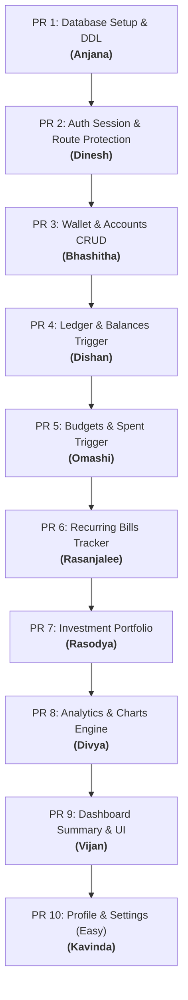

# 📊 BudgetMate - Team Task Allocations & Integration Plan

This document details the step-by-step project plan for completing the **BudgetMate** expense tracking application. The application consists of a modern React frontend and a FastAPI backend connected to an Oracle Cloud Autonomous Database.

To avoid merge conflicts, the project will be developed using a **sequential Pull Request (PR) pipeline**. Each member will work on a separate feature branch, starting only after the previous member's PR has been reviewed, approved, and merged into the `main` branch.

---

## ⚡ Database Status Notice & Setup Instruction

> [!WARNING]
> During initial system checks, the database connection returned a `DPY-6001: Service not registered` error. 
> **What this means:** The Oracle Autonomous Database instance is currently **Stopped/Paused** on Oracle Cloud (which happens automatically after a period of inactivity to save cloud credits).
> **Action Required:** Before running the backend, the project administrator must log in to the **Oracle Cloud Console**, navigate to your Autonomous Database instance, and click **"Start"** to resume the database.

---

## 📅 Pull Request Timeline & Sequence

The diagram below outlines the order of work. Each teammate's PR serves as the foundation for the next. Do not start your branch until the previous person's PR has been merged into `main`.



---

## 👥 Team Assignments Overview

| PR # | Teammate | Assigned Feature | Scope | Complexity |
| :--- | :--- | :--- | :--- | :--- |
| **PR 1** | **Anjana** | Database Setup & Registration Verification | Full Stack (DDL + Email Check API/UI) | Medium |
| **PR 2** | **Dinesh** | Auth Session & Route Protection Guards | Full Stack (JWT Verification + Auth UI) | Medium |
| **PR 3** | **Bhashitha** | Wallet & Accounts Management | Full Stack (Accounts API/UI) | High |
| **PR 4** | **Dishan** | Transaction Ledger & Balance Trigger | Full Stack (Transactions + Trigger) | High |
| **PR 5** | **Omashi** | Expense Categories & Budgets Tracker | Full Stack (Budgets + Trigger) | High |
| **PR 6** | **Rasanjalee** | Recurring Bills & Schedule Manager | Full Stack (Bills API/UI) | Medium |
| **PR 7** | **Rasodya** | Investment Portfolio Tracker | Full Stack (Assets API/UI) | Medium |
| **PR 8** | **Divya** | Analytics Queries & Chart Engine | Full Stack (Aggregates + Recharts) | Medium |
| **PR 9** | **Vijan** | Dashboard Overview API & Connection | Full Stack (Dashboard Integration) | Medium |
| **PR 10**| **Kavinda** | User Preferences & Profile (Easy Task) | Full Stack (Profile & Reset API/UI) | Easy |

---

## 🌿 Git Branching & Workflow Rules

To ensure a clean timeline and zero code conflicts:
1. **Branch Naming**: Pull the latest changes from `main` once the preceding PR is merged. Create a branch: `feature/pr<N>-<feature-name>` (e.g., `feature/pr3-accounts`).
2. **Database Schema Integrity**: Since everyone is connected to the same Oracle Autonomous Cloud Database, **do not modify existing tables** without consulting the team. Write additive stored procedures.
3. **Commit Messages**: Write descriptive commit messages, referencing the components modified (e.g., `feat(api): add create_account stored procedure call`).

---

## 🛠️ Detailed Task Allocations & Technical Specs

---

### 🗄️ PR 1: Database Setup & Registration Verification
* **Assignee**: **Anjana**
* **Complexity**: Medium
* **Prerequisite**: None (Initial Setup)
* **Branch**: `feature/pr1-database-setup`

#### 📝 Objectives:
Define the relational structure of the database. Execute the core DDL script on the Oracle Cloud Autonomous Database to prepare tables, primary/foreign key relations, and sequences. Build the email availability check backend endpoint and integrate it with the frontend registration page for real-time form validation.

#### 🗄️ SQL Schema Script to Execute:
Execute the following DDL script in your Oracle SQL Developer / SQL Worksheet:

```sql
-- 1. Users Table
CREATE TABLE USERS (
    USER_ID NUMBER GENERATED BY DEFAULT AS IDENTITY PRIMARY KEY,
    FULL_NAME VARCHAR2(100) NOT NULL,
    EMAIL VARCHAR2(100) UNIQUE NOT NULL,
    PASSWORD_HASH VARCHAR2(255) NOT NULL,
    CREATED_AT TIMESTAMP DEFAULT CURRENT_TIMESTAMP
);

-- 2. Password Resets (Temporary store for OTP verification)
CREATE TABLE PASSWORD_RESETS (
    EMAIL VARCHAR2(100) PRIMARY KEY,
    OTP VARCHAR2(6) NOT NULL,
    EXPIRY TIMESTAMP NOT NULL
);

-- 3. Accounts Table (Wallets)
CREATE TABLE ACCOUNTS (
    ACCOUNT_ID NUMBER GENERATED BY DEFAULT AS IDENTITY PRIMARY KEY,
    USER_ID NUMBER NOT NULL,
    ACCOUNT_NAME VARCHAR2(100) NOT NULL,
    ACCOUNT_TYPE VARCHAR2(50) NOT NULL, -- 'Checking', 'Credit Card', 'Investment'
    BALANCE NUMBER(15, 2) DEFAULT 0.00,
    CARD_NUMBER VARCHAR2(20),
    EXP_DATE VARCHAR2(5),
    COLOR VARCHAR2(50) DEFAULT 'bg-blue-600',
    CREATED_AT TIMESTAMP DEFAULT CURRENT_TIMESTAMP,
    CONSTRAINT FK_ACCOUNTS_USER FOREIGN KEY (USER_ID) REFERENCES USERS(USER_ID) ON DELETE CASCADE
);

-- 4. Transactions Table (Ledger)
CREATE TABLE TRANSACTIONS (
    TRANSACTION_ID NUMBER GENERATED BY DEFAULT AS IDENTITY PRIMARY KEY,
    USER_ID NUMBER NOT NULL,
    ACCOUNT_ID NUMBER NOT NULL,
    TRANSACTION_TYPE VARCHAR2(10) NOT NULL, -- 'INCOME' or 'EXPENSE'
    AMOUNT NUMBER(15, 2) NOT NULL,
    CATEGORY VARCHAR2(50) NOT NULL, -- 'Housing', 'Dining Out', 'Transport', 'Shopping', etc.
    MERCHANT VARCHAR2(100) NOT NULL,
    TRANSACTION_DATE DATE DEFAULT SYSDATE,
    DESCRIPTION VARCHAR2(255),
    CONSTRAINT FK_TRANSACTIONS_USER FOREIGN KEY (USER_ID) REFERENCES USERS(USER_ID) ON DELETE CASCADE,
    CONSTRAINT FK_TRANSACTIONS_ACCOUNT FOREIGN KEY (ACCOUNT_ID) REFERENCES ACCOUNTS(ACCOUNT_ID) ON DELETE CASCADE
);

-- 5. Budgets Table
CREATE TABLE BUDGETS (
    BUDGET_ID NUMBER GENERATED BY DEFAULT AS IDENTITY PRIMARY KEY,
    USER_ID NUMBER NOT NULL,
    CATEGORY_NAME VARCHAR2(50) NOT NULL,
    BUDGET_LIMIT NUMBER(15, 2) NOT NULL,
    SPENT_AMOUNT NUMBER(15, 2) DEFAULT 0.00,
    BUDGET_MONTH VARCHAR2(7) NOT NULL, -- Format: 'YYYY-MM'
    CONSTRAINT UC_USER_CATEGORY_MONTH UNIQUE (USER_ID, CATEGORY_NAME, BUDGET_MONTH),
    CONSTRAINT FK_BUDGETS_USER FOREIGN KEY (USER_ID) REFERENCES USERS(USER_ID) ON DELETE CASCADE
);

-- 6. Bills Table (Recurring Payments)
CREATE TABLE BILLS (
    BILL_ID NUMBER GENERATED BY DEFAULT AS IDENTITY PRIMARY KEY,
    USER_ID NUMBER NOT NULL,
    BILL_NAME VARCHAR2(100) NOT NULL,
    AMOUNT NUMBER(15, 2) NOT NULL,
    DUE_DATE DATE NOT NULL,
    CATEGORY VARCHAR2(50) NOT NULL,
    IS_PAID NUMBER(1) DEFAULT 0, -- 0 for Unpaid, 1 for Paid
    FREQUENCY VARCHAR2(20) DEFAULT 'MONTHLY', -- 'MONTHLY', 'YEARLY', 'ONCE'
    CONSTRAINT FK_BILLS_USER FOREIGN KEY (USER_ID) REFERENCES USERS(USER_ID) ON DELETE CASCADE
);

-- 7. Investments Table
CREATE TABLE INVESTMENTS (
    INVESTMENT_ID NUMBER GENERATED BY DEFAULT AS IDENTITY PRIMARY KEY,
    USER_ID NUMBER NOT NULL,
    ASSET_NAME VARCHAR2(100) NOT NULL,
    ASSET_TYPE VARCHAR2(50) NOT NULL, -- 'Stock', 'Crypto', 'Real Estate'
    QUANTITY NUMBER(15, 4) NOT NULL,
    BUY_PRICE NUMBER(15, 2) NOT NULL,
    CURRENT_PRICE NUMBER(15, 2) NOT NULL,
    INVESTED_DATE DATE DEFAULT SYSDATE,
    CONSTRAINT FK_INVESTMENTS_USER FOREIGN KEY (USER_ID) REFERENCES USERS(USER_ID) ON DELETE CASCADE
);

-- 8. User Settings Table
CREATE TABLE USER_SETTINGS (
    USER_ID NUMBER PRIMARY KEY,
    BASE_CURRENCY VARCHAR2(10) DEFAULT 'USD',
    THEME VARCHAR2(10) DEFAULT 'light',
    NOTIFICATIONS_ENABLED NUMBER(1) DEFAULT 1,
    CONSTRAINT FK_SETTINGS_USER FOREIGN KEY (USER_ID) REFERENCES USERS(USER_ID) ON DELETE CASCADE
);
```

#### 🗄️ Stored Procedures to Create:
Write and compile the following database procedures used by the authentication logic:

1. **`REGISTER_USER_PROC(p_full_name, p_email, p_password_hash, p_status OUT)`** (registers a new user, outputs `'SUCCESS'` or `'EMAIL_ALREADY_EXISTS'`).
2. **`LOGIN_USER_PROC(p_email, p_hash OUT, p_id OUT, p_name OUT, p_status OUT)`** (fetches password hash, ID, and full name for login verification).
3. **`STORE_RESET_TOKEN_PROC(p_email, p_otp, p_expiry, p_status OUT, p_error_msg OUT)`** (inserts/updates OTP code for password resets).
4. **`RESET_PASSWORD_PROC(p_email, p_otp, p_hashed_pw, p_status OUT)`** (updates password if OTP matches and is not expired).
5. **`CHECK_EMAIL_EXISTS_PROC(p_email, p_exists OUT)`** (returns 1 if email exists in `USERS`, 0 if it is available).

#### 🐍 FastAPI Backend:
* Expose an endpoint:
  - `GET /auth/check-email` -> Query parameter `email` is passed to `CHECK_EMAIL_EXISTS_PROC` to verify if the email is available.

#### ⚛️ Frontend React:
* Connect [Register.jsx](file:///c:/Users/BHASHITHA/Desktop/ADBMS_project/Budgetmate/frontend/src/pages/Register.jsx) to the backend. Submit form details to `/auth/register`.
* Integrate `/auth/check-email` to perform real-time verification as the user types their email address (e.g., showing a validation checkmark or error alert if the email is already registered).

---

### 🔑 PR 2: Auth Session & Route Protection Guards
* **Assignee**: **Dinesh**
* **Complexity**: Medium
* **Prerequisite**: PR 1 Merged
* **Branch**: `feature/pr2-auth-routing`

#### 📝 Objectives:
Configure the FastAPI security middleware to handle token validations and integrate session states, login, forgot-password, and reset-OTP interfaces in the React frontend. Secure the user pages using Protected Route guards.

#### 🐍 FastAPI Backend:
* Implement token verification middleware and dependencies (extracting the `user_id` from JWT access tokens) to secure incoming requests for the subsequent features.

#### ⚛️ Frontend React:
* Connect the login form in [login.jsx](file:///c:/Users/BHASHITHA/Desktop/ADBMS_project/Budgetmate/frontend/src/pages/login.jsx), and [ForgotPassword.jsx](file:///c:/Users/BHASHITHA/Desktop/ADBMS_project/Budgetmate/frontend/src/pages/ForgotPassword.jsx) / [VerifyOTP.jsx](file:///c:/Users/BHASHITHA/Desktop/ADBMS_project/Budgetmate/frontend/src/pages/VerifyOTP.jsx) to their corresponding backend routes.
* Update [api.js](file:///c:/Users/BHASHITHA/Desktop/ADBMS_project/Budgetmate/frontend/src/services/api.js) to append the JWT `Authorization` header to every request if a token is present in `localStorage`.
* Create a wrapper component (e.g., `ProtectedRoute.jsx`) in `frontend/src/components` that checks for `localStorage.getItem('token')` and redirects unauthorized visits to `/login` (via the landing page modal).
* Ensure the sidebar displays user credentials dynamically, and logs them out cleanly by clearing local storage session tokens on logout.

---

### 💳 PR 3: Wallet & Accounts (My Wallet) CRUD
* **Assignee**: **Bhashitha**
* **Complexity**: High
* **Prerequisite**: PR 2 Merged
* **Branch**: `feature/pr3-wallet-accounts`

#### 📝 Objectives:
Deliver full CRUD capability for managing account wallets (Checking accounts, Credit cards, Investment accounts) and linking them to the user.

#### 🗄️ Database Stored Procedures:
Write the following PL/SQL procedures:
* `CREATE_ACCOUNT_PROC(p_user_id, p_name, p_type, p_balance, p_card, p_exp, p_color, p_status)`
* `GET_ACCOUNTS_PROC(p_user_id, p_cursor OUT SYS_REFCURSOR)` (Returns active wallets for the user).
* `DELETE_ACCOUNT_PROC(p_account_id, p_status OUT VARCHAR2)`

#### 🐍 FastAPI Backend:
* Create a new router file `backend/app/routes/accounts.py` and service `backend/app/services/accounts_service.py`. Include this router in `main.py`.
* Expose endpoints:
  - `POST /accounts` -> Add new card/account.
  - `GET /accounts` -> Fetch user wallets.
  - `DELETE /accounts/{id}` -> Unlink account.
* Use dependency injection to verify the JWT token and retrieve the current user's ID.

#### ⚛️ Frontend React:
* Connect [MyWallet.jsx](file:///c:/Users/BHASHITHA/Desktop/ADBMS_project/Budgetmate/frontend/src/pages/MyWallet.jsx) to the accounts endpoints.
* Hook up the "Add New Card" modal form to the API.
* Dynamically render linked accounts and transition visual card graphics on click.

---

### 💸 PR 4: Transaction Ledger & Database Balances Trigger
* **Assignee**: **Dishan**
* **Complexity**: High
* **Prerequisite**: PR 3 Merged
* **Branch**: `feature/pr4-transactions-ledger`

#### 📝 Objectives:
Build the transaction logging ledger. Create a database trigger to automate balance recalculations on accounts when transactions are recorded or deleted.

#### 🗄️ Database Trigger & Procedures:
Write the following trigger to automate wallet balances inside the database (vital for ADBMS core score):
```sql
CREATE OR REPLACE TRIGGER TRG_UPDATE_ACCOUNT_BALANCE
AFTER INSERT OR DELETE ON TRANSACTIONS
FOR EACH ROW
BEGIN
    IF INSERTING THEN
        IF :NEW.TRANSACTION_TYPE = 'INCOME' THEN
            UPDATE ACCOUNTS
            SET BALANCE = BALANCE + :NEW.AMOUNT
            WHERE ACCOUNT_ID = :NEW.ACCOUNT_ID;
        ELSIF :NEW.TRANSACTION_TYPE = 'EXPENSE' THEN
            UPDATE ACCOUNTS
            SET BALANCE = BALANCE - :NEW.AMOUNT
            WHERE ACCOUNT_ID = :NEW.ACCOUNT_ID;
        END IF;
    ELSIF DELETING THEN
        IF :OLD.TRANSACTION_TYPE = 'INCOME' THEN
            UPDATE ACCOUNTS
            SET BALANCE = BALANCE - :OLD.AMOUNT
            WHERE ACCOUNT_ID = :OLD.ACCOUNT_ID;
        ELSIF :OLD.TRANSACTION_TYPE = 'EXPENSE' THEN
            UPDATE ACCOUNTS
            SET BALANCE = BALANCE + :OLD.AMOUNT
            WHERE ACCOUNT_ID = :OLD.ACCOUNT_ID;
        END IF;
    END IF;
END;
/
```
Create procedures:
* `ADD_TRANSACTION_PROC(p_user_id, p_account_id, p_type, p_amount, p_category, p_merchant, p_desc, p_status)`
* `GET_TRANSACTIONS_PROC(p_user_id, p_cursor OUT SYS_REFCURSOR)`
* `DELETE_TRANSACTION_PROC(p_transaction_id, p_status)`

#### 🐍 FastAPI Backend:
* Create routes `backend/app/routes/transactions.py` and service `backend/app/services/transactions_service.py`. Include this router in `main.py`.
* Expose endpoints:
  - `POST /transactions` -> Add income/expense.
  - `GET /transactions` -> Get transaction list.
  - `DELETE /transactions/{id}` -> Revert transaction.

#### ⚛️ Frontend React:
* Add a global transaction insertion form modal trigger in the layout/sidebar.
* Hook up the "Recent Transactions" table in [Dashboard.jsx](file:///c:/Users/BHASHITHA/Desktop/ADBMS_project/Budgetmate/frontend/src/pages/Dashboard.jsx) and the main transactions display fields to display actual transaction history instead of placeholders.

---

### 📊 PR 5: Expense Categories & Budgets Tracker
* **Assignee**: **Omashi**
* **Complexity**: High
* **Prerequisite**: PR 4 Merged
* **Branch**: `feature/pr5-category-budgets`

#### 📝 Objectives:
Build the monthly budget management and tracking engine. Automatically aggregate transaction values relative to user limits.

#### 🗄️ Database Trigger & Procedures:
Write a database trigger to automatically update `SPENT_AMOUNT` in the `BUDGETS` table whenever a transaction is recorded or removed:
```sql
CREATE OR REPLACE TRIGGER TRG_UPDATE_BUDGET_SPENT
AFTER INSERT OR DELETE ON TRANSACTIONS
FOR EACH ROW
DECLARE
    v_month VARCHAR2(7);
BEGIN
    IF INSERTING AND :NEW.TRANSACTION_TYPE = 'EXPENSE' THEN
        v_month := TO_CHAR(:NEW.TRANSACTION_DATE, 'YYYY-MM');
        UPDATE BUDGETS
        SET SPENT_AMOUNT = SPENT_AMOUNT + :NEW.AMOUNT
        WHERE USER_ID = :NEW.USER_ID 
          AND CATEGORY_NAME = :NEW.CATEGORY 
          AND BUDGET_MONTH = v_month;
    ELSIF DELETING AND :OLD.TRANSACTION_TYPE = 'EXPENSE' THEN
        v_month := TO_CHAR(:OLD.TRANSACTION_DATE, 'YYYY-MM');
        UPDATE BUDGETS
        SET SPENT_AMOUNT = SPENT_AMOUNT - :OLD.AMOUNT
        WHERE USER_ID = :OLD.USER_ID 
          AND CATEGORY_NAME = :OLD.CATEGORY 
          AND BUDGET_MONTH = v_month;
    END IF;
END;
/
```
Create procedures:
* `SET_BUDGET_PROC(p_user_id, p_category, p_limit, p_month, p_status)`
* `GET_BUDGETS_PROC(p_user_id, p_month, p_cursor OUT SYS_REFCURSOR)`

#### 🐍 FastAPI Backend:
* Create `backend/app/routes/budgets.py` and service files. Include this router in `main.py`.
* Expose endpoints:
  - `POST /budgets` -> Define or update budget category limit.
  - `GET /budgets/{month}` -> Get budgets for specific month.

#### ⚛️ Frontend React:
* Connect [Expenses.jsx](file:///c:/Users/BHASHITHA/Desktop/ADBMS_project/Budgetmate/frontend/src/pages/Expenses.jsx) to budget endpoints.
* Implement progress bars, active alerts when a budget is exceeded, and the "Add Category" modal.

---

### 📅 PR 6: Recurring Bills Tracker & Reminders
* **Assignee**: **Rasanjalee**
* **Complexity**: Medium
* **Prerequisite**: PR 5 Merged
* **Branch**: `feature/pr6-recurring-bills`

#### 📝 Objectives:
Implement subscription and repeating invoice trackers. Allow users to register scheduled expenses and mark them as resolved.

#### 🗄️ Database Stored Procedures:
* `CREATE_BILL_PROC(p_user_id, p_name, p_amount, p_due_date, p_category, p_freq, p_status)`
* `GET_BILLS_PROC(p_user_id, p_cursor OUT SYS_REFCURSOR)`
* `MARK_BILL_PAID_PROC(p_bill_id, p_status)`

#### 🐍 FastAPI Backend:
* Create `backend/app/routes/bills.py` and service files. Include this router in `main.py`.
* Expose endpoints:
  - `POST /bills` -> Create recurring bill.
  - `GET /bills` -> Get list of bills.
  - `PUT /bills/{id}/pay` -> Toggle paid status (marks bill paid and generates corresponding expense transaction).

#### ⚛️ Frontend React:
* Connect [Bills.jsx](file:///c:/Users/BHASHITHA/Desktop/ADBMS_project/Budgetmate/frontend/src/pages/Bills.jsx) to the backend.
* Render interactive card items with paid/unpaid indicators and connect the action button to change status.

---

### 📈 PR 7: Investment Portfolio Tracker
* **Assignee**: **Rasodya**
* **Complexity**: Medium
* **Prerequisite**: PR 6 Merged
* **Branch**: `feature/pr7-investments`

#### 📝 Objectives:
Manage user portfolios including Stocks, Cryptocurrencies, and Real Estate investments. Track purchased values versus current value.

#### 🗄️ Database Stored Procedures:
* `ADD_INVESTMENT_PROC(p_user_id, p_name, p_type, p_qty, p_buy_price, p_curr_price, p_status)`
* `GET_INVESTMENTS_PROC(p_user_id, p_cursor OUT SYS_REFCURSOR)`
* `UPDATE_INVESTMENT_PRICE_PROC(p_investment_id, p_new_price, p_status)`

#### 🐍 FastAPI Backend:
* Create `backend/app/routes/investments.py` and service files. Include this router in `main.py`.
* Expose endpoints:
  - `POST /investments` -> Add bought asset.
  - `GET /investments` -> Fetch active portfolio.
  - `PATCH /investments/{id}` -> Update current asset pricing details.

#### ⚛️ Frontend React:
* Connect [Investments.jsx](file:///c:/Users/BHASHITHA/Desktop/ADBMS_project/Budgetmate/frontend/src/pages/Investments.jsx).
* Show dynamic values for unrealized gains/losses, asset distribution totals, and link inputs.

---

### 📊 PR 8: Analytics Engine & Charts
* **Assignee**: **Divya**
* **Complexity**: Medium
* **Prerequisite**: PR 7 Merged
* **Branch**: `feature/pr8-analytics`

#### 📝 Objectives:
Perform database aggregates (grouped query runs) and present them graphically in charts to display historical budget data and categories.

#### 🗄️ Database Stored Procedures / SQL:
Create stored procedures that compute aggregated financial statistics:
* `GET_CATEGORY_BREAKDOWN_PROC(p_user_id, p_cursor OUT SYS_REFCURSOR)` (Computes total spent grouped by category for the current month).
* `GET_INCOME_VS_EXPENSE_PROC(p_user_id, p_cursor OUT SYS_REFCURSOR)` (Computes monthly income vs expense for the past 6 months).

#### 🐍 FastAPI Backend:
* Create `backend/app/routes/analytics.py` and service files. Include this router in `main.py`.
* Expose endpoints:
  - `GET /analytics/category-breakdown`
  - `GET /analytics/monthly-trends`

#### ⚛️ Frontend React:
* Connect [Analytics.jsx](file:///c:/Users/BHASHITHA/Desktop/ADBMS_project/Budgetmate/frontend/src/pages/Analytics.jsx) using Recharts.
* Populate pie charts and line charts with structured JSON data from aggregate queries.

---

### 🏠 PR 9: Unified Dashboard Overview API & Integration
* **Assignee**: **Vijan**
* **Complexity**: Medium
* **Prerequisite**: PR 8 Merged
* **Branch**: `feature/pr9-dashboard-summary`

#### 📝 Objectives:
Deliver a single high-performance aggregation endpoint that compiles data from all tables to present the homepage dashboard metrics cleanly.

#### 🗄️ Database Query Logic:
Create a stored procedure `GET_DASHBOARD_SUMMARY_PROC(p_user_id, p_total_net_worth OUT NUMBER, p_monthly_spend OUT NUMBER, p_savings_rate OUT NUMBER, p_recent_transactions OUT SYS_REFCURSOR)` that:
- Summarizes checking, credit, and investment balances.
- Calculates sum of expense transactions in the current month.
- Selects the top 5 most recent transactions.

#### 🐍 FastAPI Backend:
* Create `backend/app/routes/dashboard.py` and service files. Include this router in `main.py`.
* Expose endpoint:
  - `GET /dashboard/summary`

#### ⚛️ Frontend React:
* Connect [Dashboard.jsx](file:///c:/Users/BHASHITHA/Desktop/ADBMS_project/Budgetmate/frontend/src/pages/Dashboard.jsx) overview panels. Ensure the Net Worth header, Monthly Spend card, and Savings Rate render live calculations.

---

### ⚙️ PR 10: Profile Customization & Clear Data (Easy Task)
* **Assignee**: **Kavinda**
* **Complexity**: Easy
* **Prerequisite**: PR 9 Merged
* **Branch**: `feature/pr10-settings-profile`

#### 📝 Objectives:
Implement the User Preferences pane. Create a data-wipe button to allow account resets during testing, which deletes cascading records.

#### 🗄️ Database Stored Procedures:
* `UPDATE_SETTINGS_PROC(p_user_id, p_currency, p_theme, p_notifications, p_status)`
* `RESET_USER_DATA_PROC(p_user_id, p_status)` (Executes CASCADE deletes on Accounts, Transactions, Budgets, Bills, Investments for the user).

#### 🐍 FastAPI Backend:
* Create `backend/app/routes/settings.py` and service files. Include this router in `main.py`.
* Expose endpoints:
  - `GET /settings` -> Fetch current system configs.
  - `PUT /settings` -> Modify configs.
  - `POST /settings/reset` -> Clean database slate.

#### ⚛️ Frontend React:
* Connect [Settings.jsx](file:///c:/Users/BHASHITHA/Desktop/ADBMS_project/Budgetmate/frontend/src/pages/Settings.jsx). Ensure updates save preference cookies/tokens, and hook up the "Reset Account" warning modal.

---

## 💡 Stored Procedure and Cursor Handling Example (For Python Backend Code)

Since the backend uses the `oracledb` library, here is the standard template on how to call stored procedures that return cursors in FastAPI:

```python
from app.config.db import get_db_connection

def get_user_accounts(user_id: int):
    conn = get_db_connection()
    cursor = conn.cursor()
    try:
        # 1. Define out parameters: SYS_REFCURSOR becomes a cursor object in python
        cursor_out = conn.cursor()
        
        # 2. Call procedure
        cursor.callproc("GET_ACCOUNTS_PROC", [user_id, cursor_out])
        
        # 3. Fetch rows from cursor
        accounts = []
        for row in cursor_out:
            accounts.append({
                "account_id": row[0],
                "account_name": row[1],
                "account_type": row[2],
                "balance": float(row[3]),
                "card_number": row[4],
                "exp_date": row[5],
                "color": row[6]
            })
        return accounts
    finally:
        cursor_out.close()
        cursor.close()
        conn.close()
```
