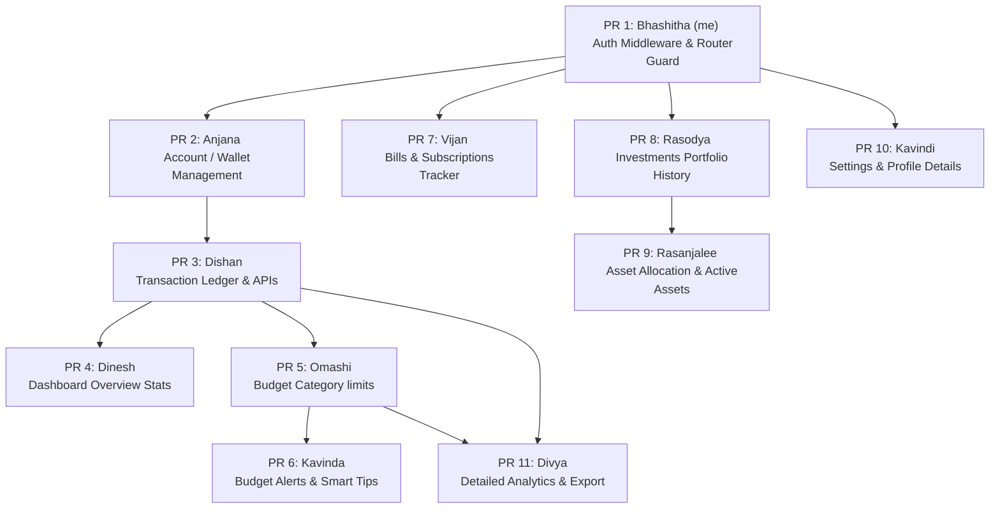

# BudgetMate Project - Task Division & Implementation Roadmap

This document outlines the database schema, task distribution, and sequential Git PR roadmap for the **BudgetMate** project.

Since this is an **ADBMS (Advanced Database Management Systems)** project, all queries, aggregations, and CRUD operations should be implemented as **SQL Server Stored Procedures, Views, or Triggers** in the database, with FastAPI acting as the thin wrapper to expose them to the React frontend.

---

## 📅 Git PR Order (Dependency Roadmap)

To avoid merge conflicts and blocked features, we will merge Pull Requests in the following sequence. Each member should branch off from the main branch _after_ the preceding PR is merged, or coordinate locally.



---

## 🗄️ Proposed Database Schema

Teammates should append these table scripts to [database_setup.sql](file:///c:/Users/BHASHITHA/Desktop/ADBMS_project/Budgetmate/backend/database_setup.sql) as they work on their respective PRs.

```sql
-- 1. Accounts Table (PR 2 - Anjana)
IF NOT EXISTS (SELECT * FROM sys.tables WHERE name = 'Accounts')
BEGIN
    CREATE TABLE Accounts (
        id INT IDENTITY(1,1) PRIMARY KEY,
        user_id INT NOT NULL FOREIGN KEY REFERENCES Users(id) ON DELETE CASCADE,
        account_name VARCHAR(100) NOT NULL, -- e.g., 'Chase Bank', 'Amex Platinum'
        account_type VARCHAR(50) NOT NULL, -- e.g., 'Checking', 'Credit Card', 'Investment'
        balance DECIMAL(18, 2) NOT NULL DEFAULT 0.00,
        card_number VARCHAR(20) NULL, -- e.g., '**** 4582'
        expiry_date VARCHAR(5) NULL, -- e.g., '08/26'
        color_theme VARCHAR(50) NULL DEFAULT 'bg-blue-600',
        created_at DATETIME DEFAULT GETDATE()
    );
END
GO

-- 2. Transactions Table (PR 3 - Dishan)
IF NOT EXISTS (SELECT * FROM sys.tables WHERE name = 'Transactions')
BEGIN
    CREATE TABLE Transactions (
        id INT IDENTITY(1,1) PRIMARY KEY,
        user_id INT NOT NULL FOREIGN KEY REFERENCES Users(id) ON DELETE CASCADE,
        account_id INT NOT NULL FOREIGN KEY REFERENCES Accounts(id),
        title VARCHAR(150) NOT NULL, -- e.g., 'Apple Store'
        category VARCHAR(100) NOT NULL, -- e.g., 'Housing', 'Dining Out', 'Entertainment', 'Transport', 'Shopping'
        amount DECIMAL(18, 2) NOT NULL, -- e.g., 241.20
        transaction_type VARCHAR(10) CHECK (transaction_type IN ('INCOME', 'EXPENSE')),
        transaction_date DATETIME DEFAULT GETDATE(),
        created_at DATETIME DEFAULT GETDATE()
    );
END
GO

-- 3. Budgets Table (PR 5 - Omashi)
IF NOT EXISTS (SELECT * FROM sys.tables WHERE name = 'Budgets')
BEGIN
    CREATE TABLE Budgets (
        id INT IDENTITY(1,1) PRIMARY KEY,
        user_id INT NOT NULL FOREIGN KEY REFERENCES Users(id) ON DELETE CASCADE,
        category VARCHAR(100) NOT NULL,
        monthly_limit DECIMAL(18, 2) NOT NULL,
        UNIQUE(user_id, category),
        created_at DATETIME DEFAULT GETDATE()
    );
END
GO

-- 4. Subscriptions / Bills Table (PR 7 - Vijan)
IF NOT EXISTS (SELECT * FROM sys.tables WHERE name = 'Subscriptions')
BEGIN
    CREATE TABLE Subscriptions (
        id INT IDENTITY(1,1) PRIMARY KEY,
        user_id INT NOT NULL FOREIGN KEY REFERENCES Users(id) ON DELETE CASCADE,
        name VARCHAR(100) NOT NULL, -- e.g., 'Spotify Premium'
        amount DECIMAL(18, 2) NOT NULL,
        billing_type VARCHAR(20) CHECK (billing_type IN ('Monthly', 'Annual')),
        due_day INT NOT NULL CHECK (due_day BETWEEN 1 AND 31),
        icon_url VARCHAR(255) NULL,
        bg_color VARCHAR(50) NULL DEFAULT 'bg-slate-50',
        created_at DATETIME DEFAULT GETDATE()
    );
END
GO

-- 5. Assets Table (PR 9 - Rasanjalee)
IF NOT EXISTS (SELECT * FROM sys.tables WHERE name = 'Assets')
BEGIN
    CREATE TABLE Assets (
        id INT IDENTITY(1,1) PRIMARY KEY,
        user_id INT NOT NULL FOREIGN KEY REFERENCES Users(id) ON DELETE CASCADE,
        asset_name VARCHAR(150) NOT NULL,
        asset_type VARCHAR(50) NOT NULL, -- e.g., 'ETF', 'Crypto', 'Stock'
        amount DECIMAL(18, 2) NOT NULL,
        growth_rate DECIMAL(5, 2) NOT NULL, -- e.g., 8.40
        is_growth_positive BIT NOT NULL DEFAULT 1,
        created_at DATETIME DEFAULT GETDATE()
    );
END
GO

-- 6. PortfolioHistory Table (PR 8 - Rasodya)
IF NOT EXISTS (SELECT * FROM sys.tables WHERE name = 'PortfolioHistory')
BEGIN
    CREATE TABLE PortfolioHistory (
        id INT IDENTITY(1,1) PRIMARY KEY,
        user_id INT NOT NULL FOREIGN KEY REFERENCES Users(id) ON DELETE CASCADE,
        record_date DATE NOT NULL,
        portfolio_value DECIMAL(18, 2) NOT NULL,
        UNIQUE(user_id, record_date)
    );
END
GO
```

---

## 👤 Task Assignments & Detailed Instructions

### Task 1: Auth & API Connection Foundation (PR 1)

**Assignee:** Bhashitha (me) — _Complex Task_

- **Database:**
  - Review existing stored procedures `register_user_proc` and `login_user_proc`.
- **Backend:**
  - Implement a JWT Token Verification dependency (e.g. `get_current_user`) in `backend/app/utils/security.py` that decodes standard `Authorization: Bearer <token>` headers.
  - Expose this dependency to secure other APIs.
  - Enable CORS configuration in `backend/app/main.py` to allow React (`http://localhost:5173`) to make API requests.
- **Frontend:**
  - Update [api.js](file:///c:/Users/BHASHITHA/Desktop/ADBMS_project/Budgetmate/frontend/src/services/api.js) to dynamically include the JWT token from `localStorage` in the request headers using an Axios Request Interceptor.
  - Update [AuthContext.jsx](file:///c:/Users/BHASHITHA/Desktop/ADBMS_project/Budgetmate/frontend/src/context/AuthContext.jsx) to load credentials from `localStorage` on boot.
  - Implement a Router Guard or simple logic in [App.jsx](file:///c:/Users/BHASHITHA/Desktop/ADBMS_project/Budgetmate/frontend/src/App.jsx) to redirect non-logged-in users from pages like `/dashboard` back to the landing page `/`.

---

### Task 2: Account & Wallet Management (PR 2)

**Assignee:** Anjana — _Complex Task_

- **Database:**
  - Create Stored Procedures:
    - `add_account_proc`: Creates an account for a user.
    - `get_user_accounts_proc`: Fetches all linked accounts for the current user.
    - `delete_account_proc`: Removes a linked account.
- **Backend:**
  - Create a schema file `backend/app/schemas/account.py`.
  - Create service wrapper in `backend/app/services/account_service.py` to execute procedures.
  - Build route endpoints in `backend/app/routes/account.py` (GET `/accounts`, POST `/accounts`, DELETE `/accounts/{id}`) protected by `get_current_user`.
- **Frontend:**
  - Connect [MyWallet.jsx](file:///c:/Users/BHASHITHA/Desktop/ADBMS_project/Budgetmate/frontend/src/pages/MyWallet.jsx).
  - Pull user accounts from backend instead of mock data.
  - Enable the "Add Card" Modal to dynamically POST new cards/accounts to the backend database.
  - Calculate Net Worth dynamically based on fetched balance sums.

---

### Task 3: Transaction Ledger (PR 3)

**Assignee:** Dishan — _Complex Task_

- **Database:**
  - Create Stored Procedures:
    - `add_transaction_proc`: Inserts a transaction. Crucially, when an expense or income is added, it must update the corresponding `balance` in the `Accounts` table inside a transaction block (`BEGIN TRANSACTION ... COMMIT`).
    - `get_user_transactions_proc`: Fetches the transactions history filtered by user.
- **Backend:**
  - Create a schema file `backend/app/schemas/transaction.py`.
  - Create service wrapper `backend/app/services/transaction_service.py` to execute procedures.
  - Create route endpoints in `backend/app/routes/transaction.py` (GET `/transactions`, POST `/transactions`) protected by `get_current_user`.
- **Frontend:**
  - Since a Transaction page isn't in React routes, create a reusable popup/form or add section on [MyWallet.jsx](file:///c:/Users/BHASHITHA/Desktop/ADBMS_project/Budgetmate/frontend/src/pages/MyWallet.jsx) or [Dashboard.jsx](file:///c:/Users/BHASHITHA/Desktop/ADBMS_project/Budgetmate/frontend/src/pages/Dashboard.jsx) to submit transactions.
  - Fetch and populate transactions.

---

### Task 4: Dashboard Stats & Recent Transactions (PR 4)

**Assignee:** Dinesh — _Complex Task_

- **Database:**
  - Create a Database View or Stored Procedure:
    - `get_dashboard_summary_proc`: Dynamically sums user cash accounts balance, investment balance, sums monthly spend (using transactions category check in the current month), and calculates current savings rate.
    - `get_recent_transactions_proc`: Retrieves the last 5 transactions for a user.
- **Backend:**
  - Create service wrappers and route endpoints under `backend/app/routes/dashboard.py` (GET `/dashboard/summary`).
- **Frontend:**
  - Connect [Dashboard.jsx](file:///c:/Users/BHASHITHA/Desktop/ADBMS_project/Budgetmate/frontend/src/pages/Dashboard.jsx) overview cards to pull real-time data: Net Worth, Monthly Spend, Savings Rate.
  - Replace mock transaction rows with the dynamic list returned by `get_recent_transactions_proc`.

---

### Task 5: Budget Limits & Category Management (PR 5)

**Assignee:** Omashi — _Medium Task_

- **Database:**
  - Create Stored Procedures:
    - `set_budget_limit_proc`: Creates/updates category monthly budgets.
    - `get_budgets_with_spent_proc`: Calculates spent amounts per category in the current month by executing `SUM(amount)` from `Transactions` grouped by category, and joins it with the `Budgets` limits.
- **Backend:**
  - Create schemas, services, and routes `backend/app/routes/budget.py` (GET `/budgets` and POST `/budgets`).
- **Frontend:**
  - Connect [Expenses.jsx](file:///c:/Users/BHASHITHA/Desktop/ADBMS_project/Budgetmate/frontend/src/pages/Expenses.jsx).
  - Retrieve the list of budgets + dynamic progress percentages.
  - Wire up the "Add Category" modal to submit new limits to the database.

---

### Task 6: Overspending Alerts & Tips (PR 6)

**Assignee:** Kavinda — _Less Complex Task_

- **Database:**
  - Develop a Database View or simple Query logic:
    - Check for any category where `Spent > Limit` for the current month.
- **Backend:**
  - Create a simple API route GET `/budgets/alerts` that checks if there is any overspent category and returns its details.
- **Frontend:**
  - In [Expenses.jsx](file:///c:/Users/BHASHITHA/Desktop/ADBMS_project/Budgetmate/frontend/src/pages/Expenses.jsx), replace the hardcoded "Overspending Alert" with data fetched from the alerts API.
  - If no categories are overspent, display the "Budget on Track" positive banner.

---

### Task 7: Bills & Subscriptions Tracker (PR 7)

**Assignee:** Vijan — _Medium Task_

- **Database:**
  - Create Stored Procedures:
    - `add_subscription_proc`: Inserts a new subscription.
    - `get_subscriptions_proc`: Fetches all user subscriptions.
    - `delete_subscription_proc`: Deletes a subscription.
- **Backend:**
  - Create schema `subscription.py`, service wrappers, and endpoints `backend/app/routes/subscription.py` (GET `/subscriptions`, POST `/subscriptions`, DELETE `/subscriptions/{id}`).
- **Frontend:**
  - Connect [Bills.jsx](file:///c:/Users/BHASHITHA/Desktop/ADBMS_project/Budgetmate/frontend/src/pages/Bills.jsx).
  - Populate calendar indicators (check which days of the month have subscriptions due) dynamically.
  - Enable the dynamic lists on "Month" and "List" tabs.
  - Calculate "Monthly Commitments" sum dynamically.

---

### Task 8: Investments Performance Timeline (PR 8)

**Assignee:** Rasodya — _Medium Task_

- **Database:**
  - Populate sample history in `PortfolioHistory` for testing.
  - Create a Stored Procedure:
    - `get_portfolio_history_proc`: Fetches record dates and portfolio values filtered by period (1W, 1M, 1Y).
- **Backend:**
  - Create service wrapper and route `/investments/history?timeframe={1W|1M|1Y}`.
- **Frontend:**
  - Connect [Investments.jsx](file:///c:/Users/BHASHITHA/Desktop/ADBMS_project/Budgetmate/frontend/src/pages/Investments.jsx) line chart component.
  - Trigger fetch on timeframe toggle (`1W`, `1M`, `1Y`) and bind chart data dynamically to Recharts.

---

### Task 9: Asset Allocation & Active Assets (PR 9)

**Assignee:** Rasanjalee — _Medium Task_

- **Database:**
  - Create Stored Procedures:
    - `get_user_assets_proc`: Fetches all investments/assets.
    - `add_asset_proc`: Links a new stock/crypto/ETF asset.
- **Backend:**
  - Expose endpoints GET `/investments/assets` and POST `/investments/assets`.
- **Frontend:**
  - In [Investments.jsx](file:///c:/Users/BHASHITHA/Desktop/ADBMS_project/Budgetmate/frontend/src/pages/Investments.jsx), map the assets list dynamically.
  - Compute the allocation percentages (Stocks vs Crypto vs Real Estate) on the fly or in SQL to render the Pie Chart correctly.

---

### Task 10: Profile Details & Password Security (PR 10)

**Assignee:** Kavindi — _Less Complex Task_

- **Database:**
  - Create Stored Procedures:
    - `update_profile_proc`: Updates user name/email.
    - `change_password_proc`: Updates the hash value.
- **Backend:**
  - Add endpoints to settings route `backend/app/routes/settings.py` (PUT `/settings/profile`, PUT `/settings/change-password`).
- **Frontend:**
  - Connect [Settings.jsx](file:///c:/Users/BHASHITHA/Desktop/ADBMS_project/Budgetmate/frontend/src/pages/Settings.jsx).
  - Allow editing profile details and submitting changes.
  - Wire up the change password form, verifying input matching.

---

### Task 11: Detailed Analytics & Export (PR 11)

**Assignee:** Divya — *Complex Task*

- **Database:**
  - Create View/Procedure:
    - `get_detailed_analytics_proc`: Summarizes daily/weekly/monthly aggregated income vs expenses.
- **Backend:**
  - Expose GET `/analytics/summary` for Recharts graphs on [Analytics.jsx](file:///c:/Users/BHASHITHA/Desktop/ADBMS_project/Budgetmate/frontend/src/pages/Analytics.jsx).
  - Implement an endpoint GET `/analytics/export` that fetches transaction history, generates a CSV formatted file, and sends it as a downloadable attachment.
- **Frontend:**
  - Bind [Analytics.jsx](file:///c:/Users/BHASHITHA/Desktop/ADBMS_project/Budgetmate/frontend/src/pages/Analytics.jsx) charts to fetched data.
  - Wire up the "Export Data" button to initiate file download from the backend.

---

## 💡 Suggestions for Success

1.  **JWT Handling:** Store the token securely in the frontend. If the API returns a `401 Unauthorized` response, redirect the user back to the landing page and clear their local storage.
2.  **Transactions & Balances:** Ensure that any transaction inserted dynamically runs alongside a corresponding account balance update inside an SQL transaction block (`BEGIN TRANSACTION ... COMMIT TRANSACTION`) to avoid database state drift.
3.  **ODBC Drivers:** Ensure all local setups have the SQL Server ODBC Driver 17 installed as noted in the [Backend README](file:///c:/Users/BHASHITHA/Desktop/ADBMS_project/Budgetmate/backend/README.md).
